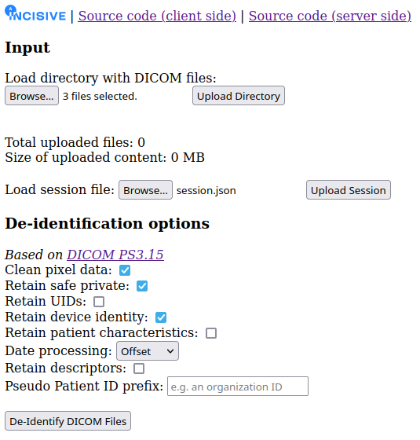

# DICOM De-Identifier

The executable provided in this repository serves as a tool for the removal of a patient's personal identifiable information (PII) from their associated DICOM files, based on a predefined set of user options. This implementation aligns with the standards specified in Nema's Attribute Confidentiality Profiles which can be accessed at [[link](https://dicom.nema.org/medical/dicom/current/output/chtml/part15/chapter_e.html)]. Primarily developed as a component of the INCISIVE project, the tool's main objective is to ensure patient anonymization.

## Utilities

A file named as `.json` contains all the currently available user options, within the following simple JSON configuration structure. One such file may contain
```
{
    "input_dcm_dp": "../session_data/raw",
    "output_dcm_dp": "../session_data/clean",
    "clean_image": true,
    "retain_safe_private": false,
    "retain_uids": false,
    "retain_device_identity": false,
    "retain_patient_characteristics": false,
    "date_processing": "remove",
    "retain_descriptors": false,
    "patient_pseudo_id_prefix": "<PREFIX ID> - "
}
```
This particular configuration is defined to be the default one, in which case the DICOM file simply applies the `Default` column from `action_groups_dcm.csv`. This last file is a basis for all possible de-identification operations, where each column corresponds to one user option. A user can define their configuration through `user_input.json`.

To explain each field

- `input_dcm_dp`, `output_dcm_dp`. Both are string type. Specify the directory paths of the imported and exported DICOM files respectively.

From now and on each explained field corresponds to a parameter in the de-identification methodology, 

- `clean_image`. Type boolean. If set to `true` then the image data is processed by the image de-identifier, effectively removing any potential burned-in text to the image pixel data that may or may not contain patient PII.
- `retain_safe_private`. Type boolean. If set to true, then for all non-empty actions of `Rtn. Safe Priv. Opt.`, the de-identification algorithm overrides the corresponding actions from the `Default` column.
- `retain_uids`. Type boolean. If set to true, it overrides the `Rtn. UIDs Opt.` column.
- `retain_device_identity`. Type boolean. If set to true, it overrides the `Rtn. Dev. Id. Opt.` column.
- `retain_patient_characteristics`. Type boolean. If set to true, it overrides the `Rtn. Pat. Chars. Opt.` column.
- `date_processing`. Type string. Value set `{offset, remove, keep}`. If option is set to
    - `offset`, it overrides the `Offset Long. Modif. Dates Opt.` column.
    - `remove`, it overrides the `Remove Long. Modif. Dates Opt.` column.
    - `remove`, it overrides the `Rtn. Long. Modif. Dates Opt.` column.
- `retain_descriptors`. Type boolean. If set to true, it overrides the `Rtn. Desc. Opt.` column.
- `patient_pseudo_id_prefix`. Type string. The concatenation of that prefix with a dummy number results in the pseudo patient ID.

## Technical Description

The backend is implemented in Python. During runtime, the input DICOM file's information is stored inside a `pydicom.dataset.FileDataset` object, where all standard object manipulations (e.g. exportation into a DICOM file) are based on the `pydicom` library.

### Directory Structure

```
.
├── action_groups_dcm.csv
├── LICENSE
├── README.md
├── requirements.txt
├── session_data
│   ├── clean
│   └── raw
├── src
│   ├── action_tools.py
│   ├── dcm_deidentifier.py
│   ├── dcm_pixel_data_cleaner.py
│   ├── generate_action_groups.py
│   ├── rw.py
│   ├── server.py
│   ├── static
│   │   ├── client.js
│   │   └── index.html
│   └── visuals.py
└── user_default_input.json
```

##### Information of `requested_action_group_dcm.csv`

This file contains the action group based on which the resulting metadata was de-identified. It is a result of the `user_input.json` and in accordance with Nema's action groups. If this is corrupted or deleted and you want to rebuild it, execute `generate_action_groups.py` with an Internet connection.

### Pixel Data Burned-in Text

A DICOM's image is de-identified based on Keras OCR's pretrained CRAFT model, a versatile rotation invariant text-image detector. [[link](https://github.com/fl0wxr/DICOMImageDeIdentifier)] for more details.

### Metadata Nema Actions

Below is a list of the currently implemented **actions** for the de-identifier.

#### Remove Tag - Code `X`

Replaces tag value with empty string. E.g.
```
dcm[<TAG_INDEX>].value = ''
```

#### Clean Tag - Code `C`

Implemented only for VRs that are either `DA` or `TM`.

`DA` -> Such tags are date tags in the format `YYYYMMDD`. The way that `C` is applied in such tags is by taking `YYYYMMDD` and adding to that date a random offset number of $\texttt{days}$ which is sampled from the following discrete uniform distribution $\mathfrak{U}$, as follows
$$\texttt{days} \sim \mathfrak{U}(365 \cdot 10, 2 \cdot (365 \cdot 10))$$

`TM` -> Day time tags in the format `HHMMSS.FFFFFF`. The way that `C` is applied in such a tag is by simply replacing its value with a random offset number of $\texttt{seconds}$ (hence there is no second-fraction), sampled as
$$\texttt{seconds} \sim \mathfrak{U}(0, 3600 \cdot 24)$$

#### Keep Tag - Code `K`

Simply keeps a tag as is.

#### Replace Tag - Code `Z`

Replaces tag value with a dummy one. Implemented only for patient ID with tag index `(0010, 0020)` and patient Name with tag index `(0010, 0010)` in which case both values are replaced by a common pseudo patient ID.

### Additional DICOM Modifications

- It should be noted that DICOM files that include instances of the `GroupLength` tag with tag code `(gggg, 0000)`, are being automatically dropped by the respective function that is used to export the DICOM object.
- Inside the output DICOM file, additional DICOM attributes were included that specify the anonymization process
    - Tag instance with code `(0012, 0063)` where its value is a concatenated sequence of codes as per Table CID 7050 from [[link](https://dicom.nema.org/medical/dicom/2019a/output/chtml/part16/sect_CID_7050.html)]. These specify how the DICOM de-identification procedure was performed.
    - Tag instance with code `(0012, 0062)` signifies if patient identity was pseudonymized/removed from both the attributes and the pixel data [[link](https://dicom.innolitics.com/ciods/rt-plan/patient/00120062)].
    - Tag instance with code `(0028, 0301)` signifies if PII was removed from burned in text in pixel data [[link](https://dicom.nema.org/medical/dicom/current/output/chtml/part15/sect_E.3.html)].

## Web Application

To run the backend
```
uvicorn server:app --reload
```
and through `localhost:8000` you can open the client. Through this window we can see



which shows the corresponding patient de-identification options.

## Citation

- Paschalis Bizopoulos: [dicom-de-identification-and-curation-tool](https://github.com/pbizopoulos/dicom-de-identification-and-curation-tool)