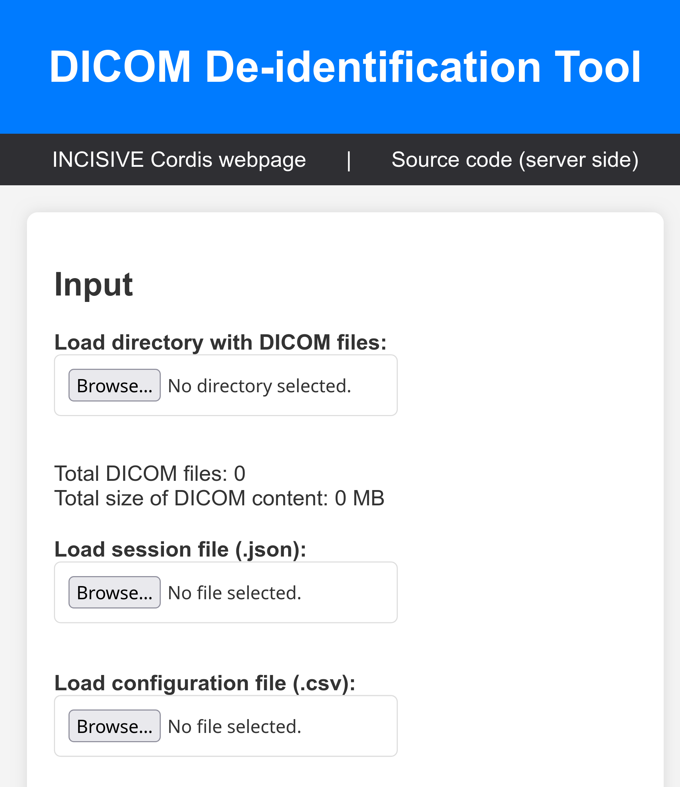
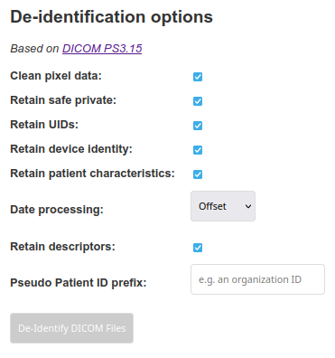
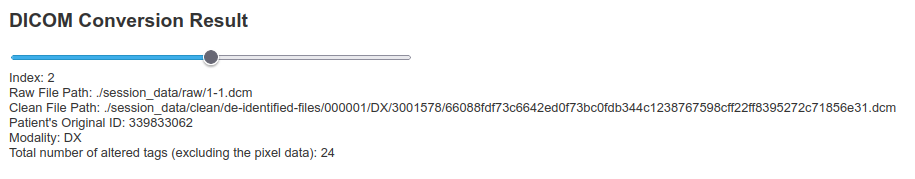
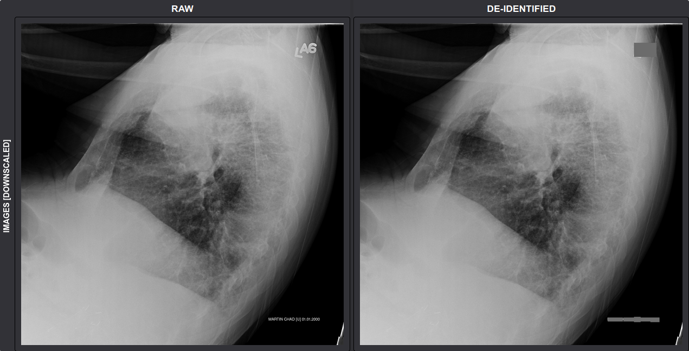
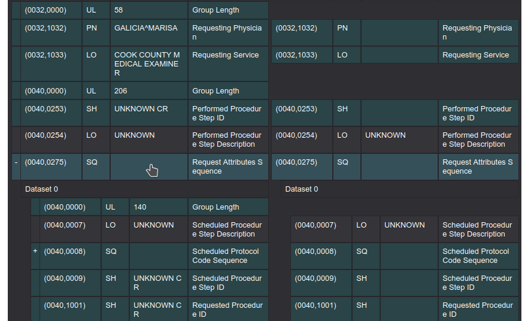
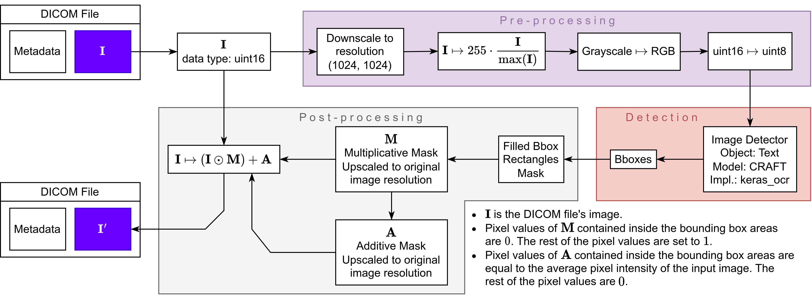

# DICOM De-Identifier

The scripts provided in this repository serve as a tool for the removal of a patient's personal identifiable information (PII) from their associated DICOM files, either through a predefined set of de-identification profiles or by using a custom end-user defined configuration file. This implementation adheres to the standards specified in NEMA's Attribute Confidentiality Profiles which can be accessed at [[link](https://dicom.nema.org/medical/dicom/current/output/chtml/part15/chapter_e.html)]. Additionally has the capability to reduct burned-in text from the DICOM's pixel data. Primarily developed as a component of the INCISIVE project, the tool's main objective is to ensure patient anonymization.

The DICOM De-Identifier provides a user-friendly interface, ensuring a smooth User Experience (UX). The UI design allows users to easily navigate through the tool and perform the necessary operations for patient data de-identification.

<p align="center" style="font-size: 80%;">
    
    </br>
    Figure 1. Upper section of the frontend's interface.
</p>

The currect system has been tested specifically on a machine equipped with an Ubuntu OS.

## Setup

The backend relies on uvicorn which can be configured through Python's FastAPI library, so these must be installed on the server's machine.

Install all prerequisites by applying
```
python3 -m pip install -r requirements.txt
```

First download and extract the latest release. For releases past `v1.3.8`, an additional step is to extract `pretrained_segmenters.tar.gz` inside `src`. From inside `src` start the server through
```
uvicorn server:app --port 8000
```
Now open a browser, type and enter `localhost:8000` on the browser's search bar. When the end-user opens the interface for the first time it will look like that of Figure 1.

For development, in the uvicorn command simply add `--reload` to consider script modifications.

### GPU Support

It should be noted that for the parallelization of pixel data de-identification, an NVIDIA GPU would contribute a lot. To install the necessary packages, the machine needs to have the corresponding NVIDIA drivers installed, along with the [CUDA toolkit](https://docs.nvidia.com/cuda/). Finally, apply the following on your python environment
```
python3 -m pip install tensorflow[and-cuda]
```

##### Advice

For cases where you want to run this code using venv and the pip package manager, uninstall the `uvicorn` package from the global pip enviroment, and have it installed only the corresponding virtual environment of venv. That is because if uvicorn is installed globally, when you have any active venv environment, the global one is found and prioritized intead, and it overrides all global libraries. To fix this, simply uninstall the global uvicorn, and install it in the venv environment (`requirements.txt` includes it).

## Utilities

In the **Input** section, the user may upload a directory containing DICOM files for patient de-identification. Additionally if the user seeks to continue the de-identification's session (e.g. because of an interruption) they can upload the corresponding session file provided as one of the server's output files.

In case the end-user wants to tailor their own de-identification process, they can do so by uploading their own `.csv` file which has to contain two columns. One with title `Tag ID` and the other with title `Action`. Each cell below `Tag ID` must hold a DICOM tag ID with a preceeding apostrophe in the format `'hhhhhhhh` and must correspond to one of the actions `K`, `X` and `C` (their functionality is specified in the Technical Description section). One such example is

<p align="center">

| Tag ID    | Action |
|-----------|--------|
| '00080050 | K      |
| '00184000 | K      |
| '00400555 | C      |
| '00101010 | C      |
| '00100040 | C      |

</p>

To select any of the pre-defined de-identification profiles (otherwise called *action groups*), the user may select the de-identification process through the **De-identification options** section.

### Options

To clarify the following descriptions, we define a new term called *action group*.

- An **action group** is a function or correspondence between multiple `Tag ID`s and `Actions`. It is a way to specify how a set of DICOM tags will be handled. We may refer to an action group as a de-identification profile as well.

One such action group is simply one of the columns in the NEMA's de-identification table. We use a simplified version of the table's **Basic Prof.** column as a default reference point on and all additional user options will be merged on that action group.

Also it is imperative that the user is familiar with [Table E.1-1. Application Level Confidentiality Profile Attributes](https://dicom.nema.org/medical/dicom/current/output/chtml/part15/chapter_e.html) for proper usage.

<p align="center" style="font-size: 80%;">
    
    </br>
    Figure 2. Pre-defined de-identification options.
</p>

Regarding the user's selected metadata de-identification process, it should be clarified that all the predefined options (see Figure 2) are in the form of action groups which have been adopted from the columns of NEMA's Table, by copying some of its columns and limiting the possible actions to `K`, `X`, `C` and `Z`. Therefore the final result simply applies a merge over multiple action groups where the basis is the mentioned action group captured from the Basic Profile column of NEMA's table.

Pre-defined action groups

- **Clean pixel data**. If ticked, then the image data is processed by the image de-identifier, effectively removing any potential burned-in text to the image pixel data that may or may not contain patient PII.
- **Retain safe private**. If ticked then for all non-empty actions of **Rtn. Safe Priv. Opt.**, the de-identification algorithm overrides the corresponding actions from the default action group.
- **Retain UIDs**. If ticked, it overrides the **Rtn. UIDs Opt.** column.
- **Retain device identity**. If ticked, it overrides the **Rtn. Dev. Id. Opt.** column.
- **Retain patient characteristics**. If ticked, it overrides the **Rtn. Pat. Chars. Opt.** column.
- **Date processing**. Options
    - **Offset**. Applies the **Offset Long. Modif. Dates Opt.** column.
    - **Remove**. Applies the **Remove Long. Modif. Dates Opt.** column.
    - **Keep**. Applies the **Rtn. Long. Modif. Dates Opt.** column.
- **Retain descriptors**. Applies the **Rtn. Desc. Opt.** column.

Another option is
- **Pseudo patient ID prefix**. Depending on the user's text input, the text concatenates with the generated patient ID as a prefix.

When the user has finished setting up their options, they may press the **De-Identify DICOM Files** button below the options. This will return the desired result in the form of a compressed directory. The directories structure may look like this
```
.
└── de-identified-files
    ├── <patient's pseudo ID>
    │   └── <modality>
    │       └── <series number>
    │           ├── <cleaned DICOM file 0>
    │           ├── <cleaned DICOM file 1>
    │           ...
    │           └── <cleaned DICOM file n>
    └── session.json
```
For multiple modalities, series numbers and patients there will be additional complexity in that structure.

Pseudo ID, pseudo date offsets and pseudo time offsets are set to be the same for a given patient. The session file can hold such information to prevent falsely generating new values for such DICOM tag fields. An example of the JSON structure of `session.json` is
```
{
    <real patient ID 0>:
    {
        "patientPseudoId": "000000",
        "daysOffset": 5082,
        "secondsOffset": 25781
    },
    <real patient ID 1>:
    {
        "patientPseudoId": "000001",
        "daysOffset": 7319,
        "secondsOffset": 10632
    },
    ...
}
```

As soon as the user submits their options and input directory, the slider activates and a new section appears below it, showing the corresponding de-identification results. The slider can be used to change the DICOM file display among all the input files (see Figures 3-5).

<p align="center" style="font-size: 80%;">
    
    </br>
    Figure 3. Slider and DICOM file information.
</p>

<p align="center" style="font-size: 80%;">
    
    </br>
    Figure 4. Image de-identification comparison.
</p>

In the table below, each row corresponds to a tag field existing in both the raw and the cleaned (de-identified) DICOM files. All altered tag fields are highlighted with cyan color. The raw file's tag values corresponding to an empty rightmost cell, implies that these tags have been completely removed from the cleaned DICOM file (e.g. see tag with ID `(0040,0275)`). Additionally the de-identifier is able to recursively consider tags with `SQ` value representation.

<p align="center" style="font-size: 80%;">
    
    </br>
    Figure 5. Header de-identification comparison. On the left side is the header of the raw DICOM file, and on the right side the header of the cleaned or de-identified DICOM file.
</p>

## In-Depth Technical Description

The backend is implemented in Python. During runtime, the input DICOM file's information is stored in a `pydicom.dataset.FileDataset` object, where all standard DICOM object manipulations (e.g. exportation into a DICOM file) are based on the `pydicom` library.

The backend may serve one client at the time and in case the user seeks to continue a session, the server must remain active between potential data processing interruptions.

##### Information of `requested_action_group_dcm.csv`

This file contains the action group based on which the resulting metadata was de-identified. It is a result of the `user_input.json` and in accordance with NEMA's action groups. If this is corrupted or deleted and you want to rebuild it, execute `generate_action_groups.py` with an Internet connection.

It is recommended to execute `generate_action_groups.py` in order to capture potential updates to the NEMA's de-identification table.

### Pixel Data Burned-in Text

A DICOM's image is de-identified based on Keras OCR's pretrained CRAFT model, a versatile rotation invariant text-image detector based on our carefully designed pipeline (Figure 6)

<p align="center" style="font-size: 80%;">
    
    </br>
    Figure 6. Image de-identification pipeline.
</p>

Visit repo [DICOMImageDeIdentifier](https://github.com/fl0wxr/DICOMImageDeIdentifier) for more details.

### Metadata NEMA Actions

Below is a list of the currently implemented **actions** for the de-identifier.

#### Remove Tag - Code `X`

Replaces tag value with empty string. E.g.
```
dcm[<TAG_INDEX>].value = ''
```

#### Clean Tag - Code `C`

Implemented only for VRs that are either `DA` or `TM`.

`DA` -> Such tags are date tags in the format `YYYYMMDD`. The way that `C` is applied in such tags is by taking `YYYYMMDD` and adding to that date a random offset number of $\texttt{days}$ which is sampled from the following discrete uniform distribution $\mathfrak{U}$, as follows
$$\texttt{days} \sim \mathfrak{U}(365 \cdot 10, 2 \cdot (365 \cdot 10))$$
This approach effectively preserves a patient's temporal correlations which helps retain useful patient information allowing for further analysis on the de-identified files.

`TM` -> Day time tags in the format `HHMMSS.FFFFFF`. The way that `C` is applied in such a tag is by simply replacing its value with a random offset number of $\texttt{seconds}$ (hence there is no second-fraction), sampled as
$$\texttt{seconds} \sim \mathfrak{U}(0, 3600 \cdot 24)$$

#### Keep Tag - Code `K`

Simply keeps a tag as is.

#### Replace Tag - Code `Z`

Replaces tag value with a dummy one. Implemented only for patient ID with tag index `(0010, 0020)` and patient Name with tag index `(0010, 0010)` in which case both values are replaced by a common pseudo patient ID.

### Additional Altered DICOM Tags

- It should be noted that DICOM files that include instances of the `GroupLength` tag with tag code `(gggg, 0000)`, are being automatically dropped by the respective function that is used to export the DICOM object.
- Inside the output DICOM file, additional DICOM attributes were included that specify the anonymization process
    - Tag instance with code `(0012, 0063)` where its value is a concatenated sequence of codes as per Table CID 7050 from [[link](https://dicom.nema.org/medical/dicom/2019a/output/chtml/part16/sect_CID_7050.html)]. These specify how the DICOM de-identification procedure was performed.
    - Tag instance with code `(0012, 0062)` signifies if patient identity was pseudonymized/removed from both the attributes and the pixel data [[link](https://dicom.innolitics.com/ciods/rt-plan/patient/00120062)].
    - Tag instance with code `(0028, 0301)` signifies if PII was removed from burned in text in pixel data [[link](https://dicom.nema.org/medical/dicom/current/output/chtml/part15/sect_E.3.html)].

## Citation

- [MedSAM](https://github.com/bowang-lab/MedSAM)
- Paschalis Bizopoulos. [dicom-de-identification-and-curation-tool](https://github.com/pbizopoulos/dicom-de-identification-and-curation-tool)